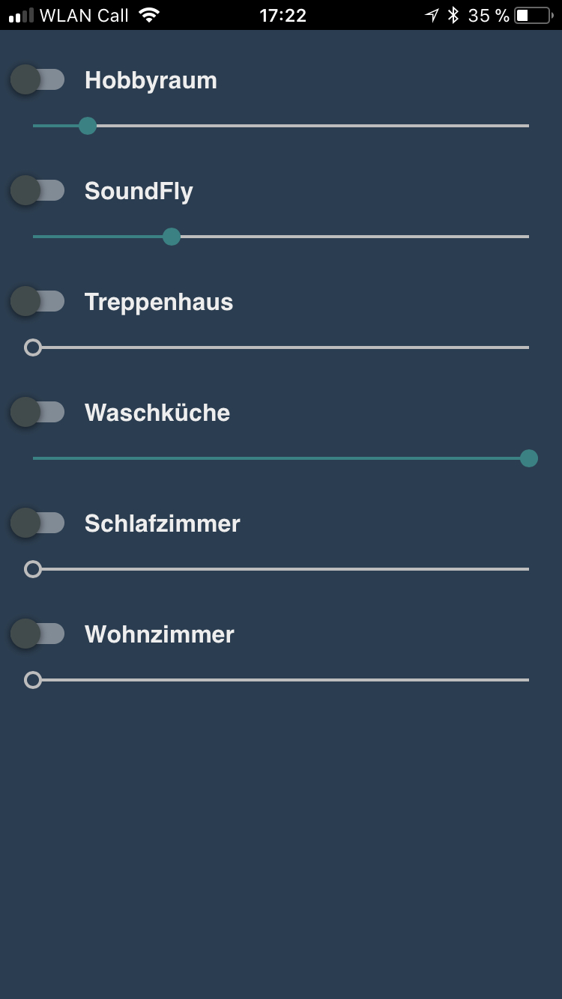
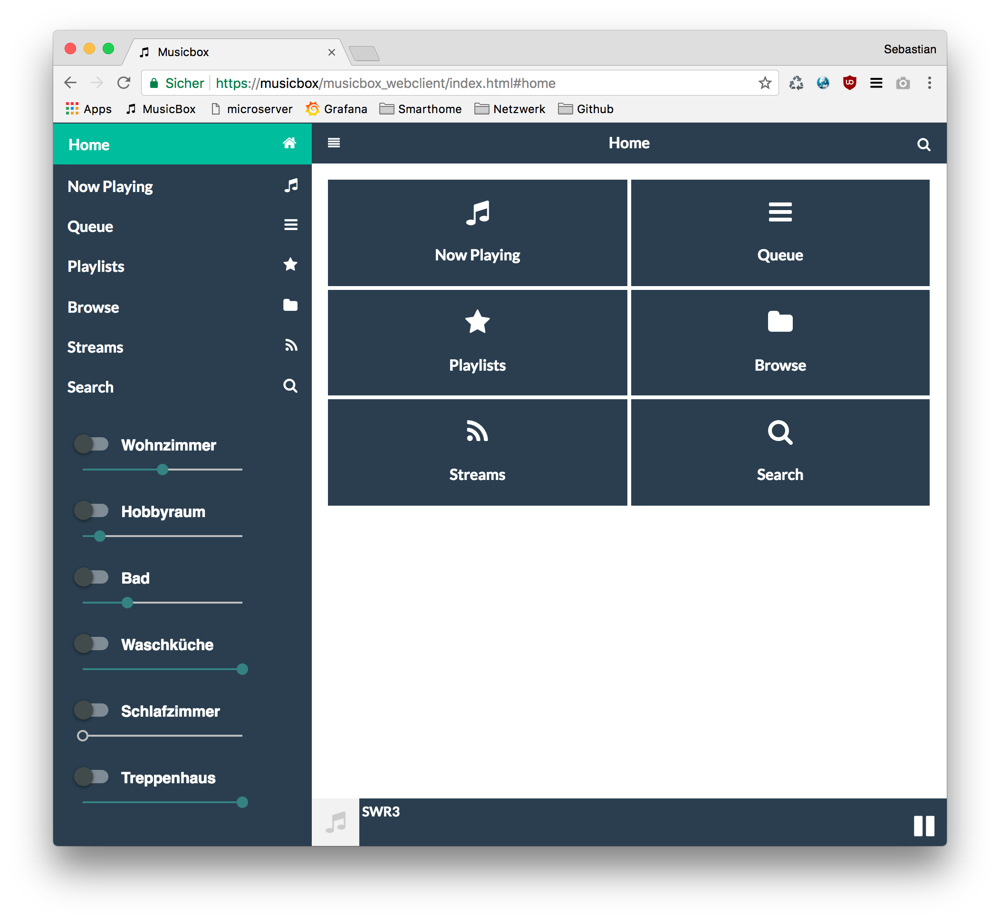

# airtunes2mqtt

[](https://github.com/mqtt-smarthome/mqtt-smarthome)
[](http://badge.fury.io/js/airtunes2mqtt)
[](https://gemnasium.com/github.com/hobbyquaker/airtunes2mqtt)
[](https://travis-ci.org/hobbyquaker/airtunes2mqtt)
[](https://github.com/sindresorhus/xo)
[![License][mit-badge]][mit-url]

> Multi-Room Audio based on Airplay/Airtunes with MQTT support 🔈

This is a little daemon that can retrieve an audio stream via TCP socket or from a Alsa Loopback device and stream it 
to one or more Airplay/Airtunes compatible receivers. Via its Web UI or MQTT you can control the receivers volume and enable/disable the 
receivers. I'm using it in conjunction with [Mopidy](https://www.mopidy.com/) to create a Multiroom Smart Home integrated
audio playback system with several Airplay Speakers.

Based on [lperrins](https://github.com/lperrin) [node_airtunes](https://github.com/lperrin/node_airtunes) - all credits 
belong to him. Also thanks to [Adam Duncan](https://github.com/microadam) for creating a 
[fork](https://github.com/microadam/node_airtunes) that works with recent versions of Node.js.


## Installation

Prerequisite: Node.js >= 6

```
$ sudo npm install -g airtunes2mqtt
$ airtunes2mqtt --help
```

I suggest to use [pm2](http://pm2.keymetrics.io/) to manage the airtunes2mqtt process (start on system boot, manage log 
files, ...).


## Command Line Options

```
Usage: airtunes2mqtt [options]

Options:
  --disable-web    disable web server
  --web-port       web server listening port                     [default: 8096]
  --version        Show version number                                 [boolean]
  -h, --help       Show help                                           [boolean]
  -u, --mqtt-url   mqtt broker url. May contain user/password
                                                   [default: "mqtt://127.0.0.1"]
  -s, --speaker    name:host:port or name:host:portStart:portEnd of speaker. May
                   be repeated.                                       [required]
  -n, --name       instance name. used as mqtt client id and as prefix for
                   connected topic                         [default: "airtunes"]
  -v, --verbosity  possible values: "error", "warn", "info", "debug"
                                                               [default: "info"]
  -p, --port       TCP Listen port for audio reception          [default: 12346]
  -l, --loopback   Use Alsa loopback device instead of TCP listener    [boolean]
  -d, --device     Alsa loopback device               [default: "hw:Loopback,1"]
```


### Example Command Line

```
$ airtunes2mqtt -s LivingRoom:192.168.2.100:5000 Kitchen:192.168.2.103:5000 -s SoundFly:192.168.2.105:1024:1032 -v debug
```

### Example Mopidy Configuration

```
[audio]
output = audioconvert ! audio/x-raw,format=S16LE,rate=44100,channels=2,layout=interleaved ! tcpclientsink host=127.0.0.1 port=12346
```


## Web UI

Airtunes2mqtt offers a simple user interface (web app capable) to enable/disable speakers and adjust volume:




### Mopidy UI integration

I just added the airtunes2mqtt ui into the frontend of my mopidy server ("musicbox webclient") by removing the original
volume slider and adding an iframe:


`/usr/local/lib/python2.7/dist-packages/mopidy_musicbox_webclient/static/index.html`

```diff
         <li data-icon="false">
-            <div><!-- slider for volume -->
-                <a href="#" onclick="controls.doMute(); return false;"><span title="Toggle mute"><i id="mutebt" class="fa fa-volume-up"></i></span></a>
-                <label for="volumeslider" class="ui-hidden-accessible">Volume</label>
-                <input id="volumeslider" data-highlight="true" name="volumeslider" data-mini="true" type="range" min="0"
-                       value="0" max="100"/>
-            </div>
+            <iframe style="border:0;padding:0;margin:0;height:450px;width:240px;" src="http://192.168.2.100:8096/ui/index.html"></iframe>
         </li>
```


## MQTT Topics

### subscribed

* `airtunes/set/<speaker-name>/enable` - Enable or disable a speaker (payload can be `true`, `false`, `0` or `1`)
* `airtunes/set/<speaker-name>/disable` - Disable a speaker (payload is irrelevant)
* `airtunes/set/<speaker-name>/volume` - Set a speakers volume (payload has to be a number between `0` and `100`)

### published

* `airtunes/connected` - Publishes `1` after airtunes2mqtt started, `2` when a client is connected via tcp socket 
respectively when the alsa loopback device is connected and `0` as last will.
* `airtunes/status/activeSpeakers` - Number of currently enables speakers.
* `airtunes/status/speaker/enable` - Actual speaker state.
* `airtunes/status/speaker/volume` - Actual speaker volume.

## License

Copyright (c) 2015-2018 Sebastian 'hobbyquaker' Raff <hobbyquaker@gmail.com>

[mit-badge]: https://img.shields.io/badge/License-MIT-blue.svg?style=flat
[mit-url]: LICENSE
